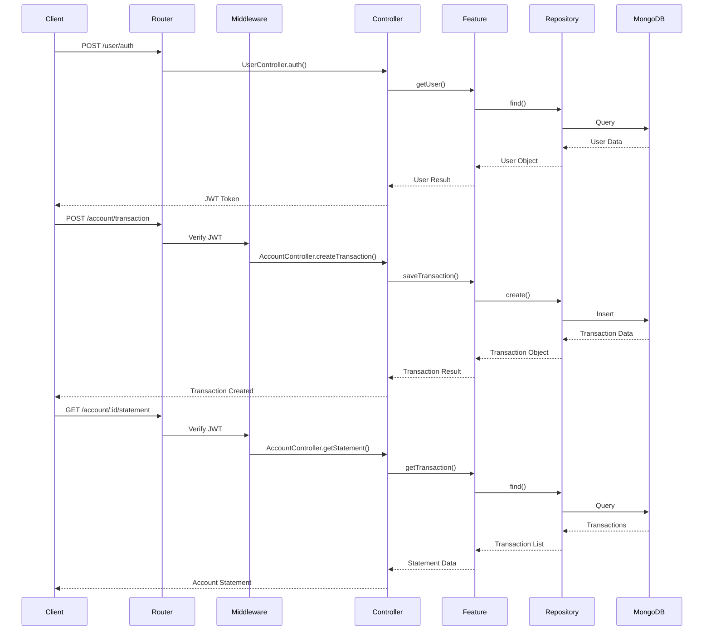

```mermaid
sequenceDiagram
    participant C as Client
    participant R as Router
    participant M as Middleware
    participant Ctrl as Controller
    participant F as Feature
    participant Rep as Repository
    participant DB as MongoDB

    %% User Authentication Flow
    C->>R: POST /user/auth
    R->>Ctrl: UserController.auth()
    Ctrl->>F: getUser()
    F->>Rep: find()
    Rep->>DB: Query
    DB-->>Rep: User Data
    Rep-->>F: User Object
    F-->>Ctrl: User Result
    Ctrl-->>C: JWT Token

    %% Account Transaction Flow
    C->>R: POST /account/transaction
    R->>M: Verify JWT
    M->>Ctrl: AccountController.createTransaction()
    Ctrl->>F: saveTransaction()
    F->>Rep: create()
    Rep->>DB: Insert
    DB-->>Rep: Transaction Data
    Rep-->>F: Transaction Object
    F-->>Ctrl: Transaction Result
    Ctrl-->>C: Transaction Created

    %% Account Statement Flow
    C->>R: GET /account/:id/statement
    R->>M: Verify JWT
    M->>Ctrl: AccountController.getStatement()
    Ctrl->>F: getTransaction()
    F->>Rep: find()
    Rep->>DB: Query
    DB-->>Rep: Transactions
    Rep-->>F: Transaction List
    F-->>Ctrl: Statement Data
    Ctrl-->>C: Account Statement
```