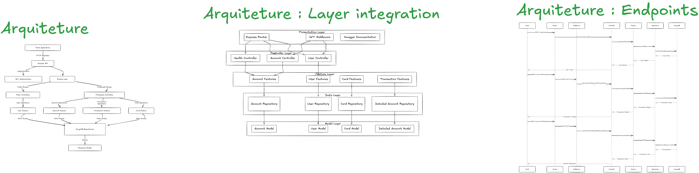

# Diagramas do Projeto

Este diretório contém os diagramas relacionados à arquitetura e modelagem do projeto.

## Estrutura do Diretório

```
diagrams/
├── arquitetura/         # Diagramas de arquitetura do sistema
└── fluxos/             # Diagramas de fluxo do sistema
```

## Descrição dos Diagramas

### Arquitetura
- Diagramas que representam a arquitetura do sistema

### Banco de Dados
- Modelos de entidade-relacionamento
- Esquemas do banco de dados
- Mapeamento de dados

### Fluxos
- Diagramas de sequência
- Fluxos de processos
- Casos de uso

### Preview
Use Mermaidjs  como extensão ou no site para visualizar os diagramas
[mermaidjs](https://mermaid.js.org/syntax/stateDiagram.html)



