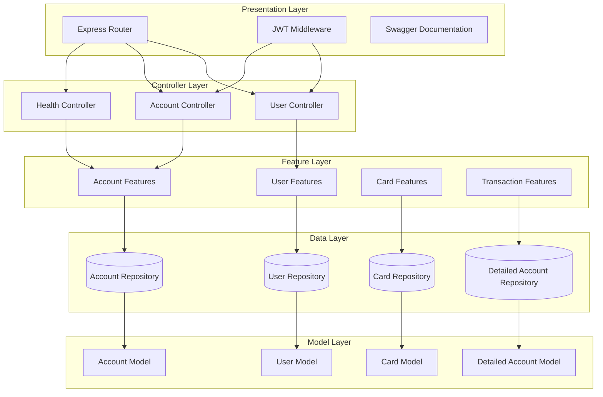

```mermaid
flowchart TB
    subgraph Presentation Layer
        Router[Express Router]
        Middleware[JWT Middleware]
        SwaggerDocs[Swagger Documentation]
    end

    subgraph Controller Layer
        UserC[User Controller]
        AccountC[Account Controller]
        HealthC[Health Controller]
    end

    subgraph Feature Layer
        UserF[User Features]
        AccountF[Account Features]
        CardF[Card Features]
        TransactionF[Transaction Features]
    end

    subgraph Data Layer
        UserR[(User Repository)]
        AccountR[(Account Repository)]
        CardR[(Card Repository)]
        TransactionR[(Detailed Account Repository)]
    end

    subgraph Model Layer
        UserM[User Model]
        AccountM[Account Model]
        CardM[Card Model]
        TransactionM[Detailed Account Model]
    end

    Router --> UserC
    Router --> AccountC
    Router --> HealthC
    Middleware --> UserC
    Middleware --> AccountC
    
    UserC --> UserF
    AccountC --> AccountF
    HealthC --> AccountF
    
    UserF --> UserR
    AccountF --> AccountR
    CardF --> CardR
    TransactionF --> TransactionR
    
    UserR --> UserM
    AccountR --> AccountM
    CardR --> CardM
    TransactionR --> TransactionM
```